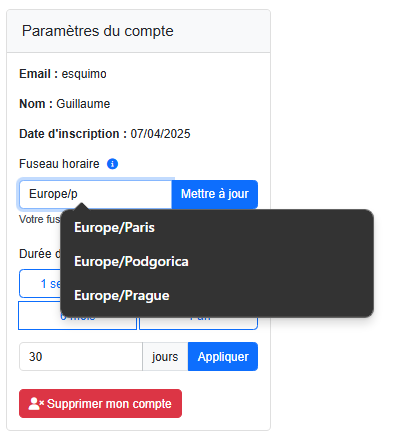

# Guide d'utilisation CalFusion

## Installation et Configuration

### Connexion à l'application

1. Accédez à la page d'accueil
2. Cliquez sur "Se connecter avec Google"
3. Autorisez l'accès à vos calendriers

### Ajout de calendriers

#### Google Calendar

1. Cliquez sur "Ajouter un calendrier Google"
2. Sélectionnez les calendriers à synchroniser
3. Les calendriers apparaîtront dans votre liste

#### iCloud Calendar

1. Cliquez sur "Ajouter un calendrier iCloud"
2. Entrez vos identifiants iCloud (mot de passe pour application)
3. Sélectionnez les calendriers à synchroniser

## Utilisation quotidienne

### Page d'accueil

1. Liste des calendriers
2. Options de synchronisation
3. URL du calendrier combiné

### Page de statistiques

1. Liste des calendriers
2. Options de synchronisation
3. URL du calendrier combiné

### Paramètres

1. Configuration du fuseau horaire
2. Durée de synchronisation
3. Préférences d'affichage

## Raccourcis clavier

- `Ctrl + R` : Rafraîchir les calendriers
- `Ctrl + T` : Changer de thème
- `Ctrl + S` : Accéder aux paramètres 